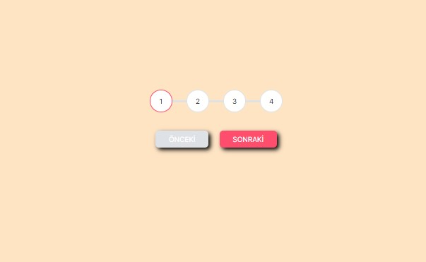

# Progress Steps

This project implements progress steps with buttons to navigate between steps. Each step is represented by a circle that changes color when active.

## Table of Contents

- [Description](#description)
- [Screenshot](#screenshot)
- [Technologies Used](#technologies-used)
- [How to Use](#how-to-use)
- [Contributing](#contributing)
- [License](#license)

## Description

The web page consists of progress steps represented by circles and buttons to navigate between steps. The progress bar dynamically adjusts its width based on the current active step. Users can click on the "Next" and "Previous" buttons to move forward or backward through the steps.

## Screenshot

## Live Demo

[View Live Demo](https://your-live-demo-url.com)

## Technologies Used

- HTML5
- CSS3
- JavaScript

## How to Use

1. Clone this repository to your local machine.
2. Open the `index.html` file in your web browser.
3. Click on the "Next" button to proceed to the next step.
4. Click on the "Previous" button to go back to the previous step.

## Contributing

Contributions to this project are welcome! If you'd like to enhance the project or fix any issues, feel free to fork the repository and submit a pull request.

## License

This project is licensed under the [MIT License](LICENSE).
